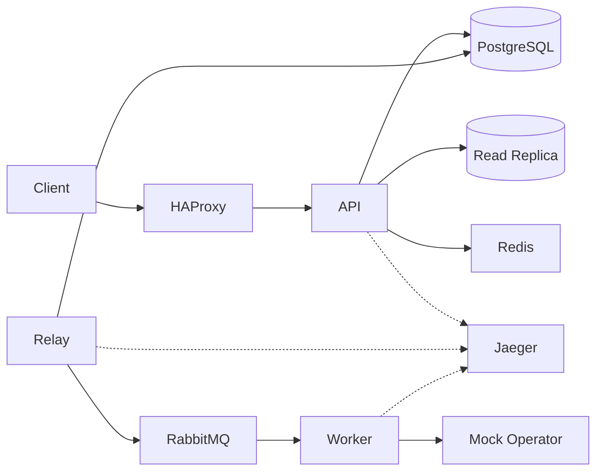

# SMS Gateway — Architecture & Implementation

> Engineering submission for ArvanCloud software developer challenge.

## Overview

This project implements a prepaid SMS Gateway REST API designed for high throughput (~100M messages/day) with burst tolerance. The API accepts send requests asynchronously (`202 Accepted`), deducts balance in a transactional path, and delivers messages through a RabbitMQ-backed pipeline with a transactional outbox pattern.

Key patterns: fire-and-forget acceptance, transactional outbox, idempotent API and consumers, read/write database split, express (OTP) priority queues, and circuit breaker on the operator adapter.

## Architecture

The system comprises three Go binaries (`api`, `worker`, `outbox-relay`), PostgreSQL, Redis, and RabbitMQ via docker-compose. Account identification, prepaid balance, and ledger audit trail support multi-tenant usage. Send requests use fire-and-forget acceptance with a transactional outbox and idempotent retries. Delivery runs asynchronously through an outbox relay, RabbitMQ, a mock operator, and worker status updates. Resilience includes Redis rate limiting, express/standard bulkhead pools, circuit breaker, DLQ, HAProxy, and express SLA metrics. Observability covers OpenTelemetry tracing (Jaeger), Prometheus metrics, structured logs with `trace_id`, and Swagger UI.



## Key Design Decisions

- **Modular monolith** with separate binaries for API, worker, and outbox relay — clear scaling boundaries without full microservice overhead.
- **Transactional outbox** ensures balance deduction and message enqueue are atomic.
- **Pre-seeded `X-Account-Token`** instead of a full auth system, per challenge requirements. Tokens are stored as SHA-256 hashes; middleware resolves `account_id` on every `/v1/*` request.
- **CQRS-lite read/write split** via GORM dbresolver: mutations hit primary; ledger and SMS list/get reads use the streaming read replica. **Balance reads use primary** so clients see sends/topups immediately without replica lag.

## Account & Balance

| Endpoint | Method | DB | Description |
|---|---|---|---|
| `/v1/account/topup` | POST | Write (primary) | Demo/admin topup — increases balance + ledger entry in one TX |
| `/v1/account/balance` | GET | Read (primary) | Current prepaid balance (primary avoids stale reads after send/topup) |
| `/v1/account/ledger` | GET | Read (replica) | Cursor-paginated topup/deduct history |

**Topup transaction:** `BEGIN` → `SELECT ... FOR UPDATE` on account → update balance → insert `account_ledger` (reason=`topup`) → `COMMIT`.

**Multi-tenant isolation:** every query filters by `account_id` from the resolved token. Invalid or missing token → `401 Unauthorized`.

**Demo tokens** (created by `make seed`):

- `demo-token-account-a`
- `demo-token-account-b`

Topup is exposed for demo/reviewer convenience; in production it would be restricted by network ACL or admin credentials.

## Send SMS + Outbox

| Endpoint | Method | DB | Description |
|---|---|---|---|
| `/v1/sms/send` | POST | Write (primary) | Accept send, deduct balance, insert message + outbox in one TX → `202` |
| `/v1/sms` | GET | Read (replica) | Cursor-paginated message list |
| `/v1/sms/{id}` | GET | Read (replica) | Single message status |

**Send transaction (same TX, lock order: idempotency → account → deduct):**

```sql
BEGIN;
-- idempotency: claim key or return cached snapshot (if Idempotency-Key present)
INSERT INTO idempotency_keys ...;  -- ON CONFLICT → return existing snapshot or 409 in-flight
SELECT balance FROM accounts WHERE id = $1 FOR UPDATE;
UPDATE accounts SET balance = balance - cost WHERE id = $1;
INSERT INTO account_ledger (delta, reason='send', ref_id=message_id);
INSERT INTO sms_messages (status='accepted', ...);
INSERT INTO outbox_events (event_type='sms.send_requested', status='pending', payload=...);
UPDATE idempotency_keys SET response_snapshot = ...;  -- if Idempotency-Key present
COMMIT;
```

**Validation:** E.164 phone (`+989...`), single-page body (GSM-7 ≤160 chars, UCS-2 ≤70 for Persian/Unicode), `message_type` = `standard` | `express`. Cost = 1 unit per message (same price for EN/FA).

**Idempotency:** optional header `Idempotency-Key: <UUID>`. Unique `(account_id, idempotency_key)`. Middleware fast-path checks **Redis cache** (24h TTL, optional) then PostgreSQL; returns stored `202` response. Duplicate in-flight requests get `409 Conflict` instead of a second deduct. Worker dedup via `processed_consumer_events`.

**Outbox:** relay publishes pending rows to RabbitMQ with publisher confirms; worker completes delivery. No RabbitMQ publish before TX commit.

Example:

```bash
curl -X POST http://localhost:8080/v1/sms/send \
  -H "X-Account-Token: demo-token-account-a" \
  -H "Content-Type: application/json" \
  -d '{"to":"+989121234567","body":"Hello","message_type":"standard"}'

# Safe retry with idempotency
curl -X POST http://localhost:8080/v1/sms/send \
  -H "X-Account-Token: demo-token-account-a" \
  -H "Idempotency-Key: 550e8400-e29b-41d4-a716-446655440000" \
  -H "Content-Type: application/json" \
  -d '{"to":"+989121234567","body":"Hello","message_type":"standard"}'
```

**Errors:** `402` insufficient balance, `409` idempotency in progress (retry later), `400` validation (phone, body length, message type).

## Async Pipeline

After the send transaction commits, delivery continues asynchronously:

```text
API TX (deduct + sms_messages + outbox pending)
  → outbox-relay (FOR UPDATE SKIP LOCKED)
  → RabbitMQ queue by message_type (sms.express | sms.standard)
  → worker (dedup + HTTP mock operator)
  → sms_messages.status = sent
```

| Binary | Role |
|---|---|
| `outbox-relay` | Polls `outbox_events`, publishes with publisher confirms, marks `published` |
| `worker` | Consumes both queues, calls mock operator, updates status |
| `mock-operator` | Configurable latency/failure HTTP stand-in for telco operator |

**Relay:** `SELECT ... WHERE status='pending' FOR UPDATE SKIP LOCKED`, set `locked_until`, skip if already `published`, publish JSON payload with publisher confirms, then `UPDATE status='published'` (idempotent mark with retries). If publish succeeds but mark fails, the relay **does not** release the lock for immediate republish — it retries mark on the next poll. On publish failure: increment `retry_count`, release lock. Duplicate publishes (at-least-once) are safe because workers dedup by `message_id`.

**Worker dedup:** `processed_consumer_events(message_id)` claim with `ON CONFLICT DO NOTHING` **before** operator call; transient failures release the claim for retry; permanent operator errors mark `failed` and ack. Duplicate deliveries are acked without double operator calls.

**Graceful shutdown:** relay and worker stop polling/consuming on SIGTERM, wait for in-flight work up to configured timeout.

Example end-to-end:

```bash
docker compose up -d
make migrate-up && make seed

# four terminals (or compose services in production)
make run-api
make run-mock-operator
make run-relay
make run-worker

curl -X POST http://localhost:8080/v1/sms/send \
  -H "X-Account-Token: demo-token-account-a" \
  -H "Content-Type: application/json" \
  -d '{"to":"+989121234567","body":"Hello","message_type":"standard"}'

# Poll until status becomes sent
curl http://localhost:8080/v1/sms/{message_id} \
  -H "X-Account-Token: demo-token-account-a"
```

## Resilience & Scale

| Component | Behavior |
|---|---|
| Rate limit | Redis sliding window per `account_id` (default 100 req/s) → `429` + `Retry-After` |
| Bulkhead | Separate semaphores for `sms.express` (20) and `sms.standard` (50) worker pools |
| Circuit breaker | `gobreaker` on operator HTTP — open state requeues messages (no sync blocking) |
| DLQ | After max delivery attempts → `sms.dlq` queue + `dead_lettered` status |
| HAProxy | L7 round-robin across 2 API replicas with `/health/ready` checks |
| Express SLA | Histogram `express_operator_delivery_seconds` on worker `:9091/metrics` |

**Rate limiting** runs after token resolution on all `/v1/*` routes. Key pattern: `ratelimit:{account_id}`.

**Bulkhead** ensures express OTP traffic keeps dedicated concurrency even when the standard queue is flooded.

**Circuit breaker** opens after consecutive operator failures; workers nack/requeue while CB is open so messages stay durable in RabbitMQ.

**DLQ path:** worker sums RabbitMQ `x-death` rejection counts (with numeric type coercion); when attempts ≥ `WORKER_MAX_DELIVERY_ATTEMPTS` (default 5), DB status becomes `dead_lettered` first, then payload is copied to `sms.dlq` (retry-safe if publish fails). If `x-death` is absent, `redelivered=true` counts as one prior attempt.

Example HAProxy entrypoint:

```bash
docker compose up -d
make migrate-up && make seed
# API available via HAProxy on :8080
curl http://localhost:8080/v1/account/balance \
  -H "X-Account-Token: demo-token-account-a"
```

Worker metrics:

```bash
curl http://localhost:9091/metrics | grep express_operator_delivery_seconds
curl http://localhost:9091/metrics | grep circuit_breaker_state
```

## Observability

| Layer | Implementation |
|---|---|
| Tracing | OpenTelemetry OTLP → Jaeger (`TELEMETRY_OTLP_ENDPOINT`, default `localhost:4318`) |
| Metrics | Prometheus — API `GET /metrics`, worker `:9091/metrics`, outbox-relay `:9092/metrics` |
| Dashboards | Custom Grafana dashboard (`deploy/grafana/dashboards/sms-gateway.json`) — provisioned via docker-compose |
| Logs | JSON `slog` with `trace_id` when a span is active |
| API docs | `swag` → `api/openapi/`, UI at `/swagger/index.html` |

**End-to-end trace:** HTTP handler (`otelgin`) → `sms.send` TX span → trace context stored in outbox payload → relay `outbox.publish` → RabbitMQ W3C headers → worker `worker.process` + `operator.send` (otel HTTP transport).

**Prometheus metrics (API `/metrics`):**

| Metric | Type | Description |
|---|---|---|
| `sms_accept_total` | counter | Send accepts by HTTP status |
| `sms_accept_duration_seconds` | histogram | `POST /v1/sms/send` latency |
| `balance_deduct_errors_total` | counter | Insufficient balance / deduct failures |
| `outbox_pending_gauge` | gauge | Unpublished outbox rows (polled every 15s) |

Worker (`:9091/metrics`) exposes `express_operator_delivery_seconds` and `circuit_breaker_state`. Outbox-relay (`:9092/metrics`) exposes `outbox_publish_errors_total` and shared registry metrics.

Example:

```bash
# Grafana dashboard (admin / admin)
open http://localhost:3000/d/sms-gateway/sms-gateway

# Prometheus targets
open http://localhost:9090/targets

# Jaeger UI (docker-compose)
open http://localhost:16686

# API metrics
curl http://localhost:8080/metrics | grep sms_accept

# Outbox-relay metrics
curl http://localhost:9092/metrics | grep outbox_publish_errors_total

# Regenerate OpenAPI after handler changes
make swagger
```

**Grafana dashboard panels (custom, not imported):**

| Panel | Metric / query |
|---|---|
| SMS accept rate | `sum(rate(sms_accept_total[5m]))` |
| Accept latency p50/p95/p99 | `histogram_quantile` on `sms_accept_duration_seconds` |
| Balance deduct errors | `rate(balance_deduct_errors_total[5m])` |
| Outbox backlog | `outbox_pending_gauge` |
| Outbox publish errors | `rate(outbox_publish_errors_total[5m])` |
| Express delivery SLA | `histogram_quantile` on `express_operator_delivery_seconds` |
| Circuit breaker state | `circuit_breaker_state` (0=closed, 1=half-open, 2=open) |

**Config:** `TELEMETRY_ENABLED=true`, `TELEMETRY_OTLP_ENDPOINT=jaeger:4318` in compose; set `TELEMETRY_ENABLED=false` to disable export locally.

## Scale Considerations

Target: ~1.2K msg/s average, 12–25K msg/s peak. API returns quickly; workers scale horizontally. HAProxy load-balances API replicas; rate limiting and bulkhead pools protect tenants and express SLA.

## How to Run

```bash
cp .env.example .env
docker compose up -d
make migrate-up
make seed
make run-api
```

Example:

```bash
curl -X POST http://localhost:8080/v1/account/topup \
  -H "X-Account-Token: demo-token-account-a" \
  -H "Content-Type: application/json" \
  -d '{"amount":1000}'

curl http://localhost:8080/v1/account/balance \
  -H "X-Account-Token: demo-token-account-a"
```

Health checks:

- Liveness: `GET http://localhost:8080/health/live`
- Readiness: `GET http://localhost:8080/health/ready` (pings PostgreSQL primary and read replica via GORM dbresolver)

Infrastructure (docker-compose):

| Service   | Port  |
|-----------|-------|
| HAProxy (API) | 8080 |
| PostgreSQL primary | 5433 |
| PostgreSQL read replica | 5434 |
| Redis      | 6379 |
| RabbitMQ   | 5672 (AMQP), 15672 (management UI) |
| Mock Operator | 8090 |
| Worker metrics | 9091 |
| Outbox-relay metrics | 9092 |
| Prometheus UI | 9090 |
| Grafana UI | 3000 (admin / admin) |
| Jaeger UI | 16686 |
| OTLP HTTP | 4318 |

## API Documentation

Swagger UI: `http://localhost:8080/swagger/index.html`  
OpenAPI spec: `api/openapi/swagger.json` (regenerate with `make swagger`).

## Testing

```bash
make check    # lint + unit tests + race detector + integration tests
make test
make test-integration   # PostgreSQL integration (requires docker compose postgres)
```

| Layer | Coverage |
|---|---|
| Unit | domain validation (E.164, GSM-7/UCS-2), idempotency, rate limiter, circuit breaker |
| Integration | balance TX, send + outbox, idempotency concurrency, 100-goroutine send spend limit, 100-goroutine topup |
| API | handler status codes (402, 409), cursor pagination, multi-tenant isolation |
| Concurrency | `-race` on 100 parallel sends with balance=100 → balance=0, no overdraft |
| Load | k6 script — default 80 RPS (fits rate limit); stress target 1K RPS with raised limit |

**Acceptance tests (automated):**

- balance=3, cost=1 → 3 sends OK, 4th → 402, balance=0
- 100 concurrent sends on balance=100 → balance=0, no negative balance
- Idempotency: same key → same response, one deduct
- Account A cannot read account B messages
- EN body >160 chars and FA body >70 chars rejected

Load test (requires running stack + `make seed`):

```bash
make load-test
# default 80 RPS — under RATE_LIMIT_LIMIT=100 per account

# ~1K RPS stress (raise RATE_LIMIT_LIMIT or set RATE_LIMIT_ENABLED=false first):
make load-test-stress
```

Default rate limit is **100 req/s per account** (Redis sliding window). `make load-test` uses 80 RPS so the run passes without tuning. For the design-target ~1K RPS accept load test, increase `RATE_LIMIT_LIMIT` (e.g. 2000) or disable rate limiting, restart API replicas, then run `make load-test-stress`.

## Demo Script

For reviewers — end-to-end curl walkthrough:

```bash
docker compose up -d
make migrate-up && make seed
./scripts/demo.sh
# or: make demo
```

The script checks readiness, balance, topup, send (202), async delivery (`status=sent`), idempotency, list/get reports, and multi-tenant isolation (404 cross-account).

Demo tokens are seeded with **10,000** prepaid units each (`demo-token-account-a`, `demo-token-account-b`).

## Trade-offs

- **PostgreSQL streaming replication** in docker-compose (`postgres-primary` + `postgres-replica`); API sets `DATABASE_REPLICA_DSN` so GORM dbresolver routes SMS list/get and ledger reads to the replica. When `DATABASE_REPLICA_DSN` is empty, reads fall back to primary.
- **Single-node Redis** in compose (rate limit + idempotency cache); HAProxy load-balances two API replicas.
- **Topup endpoint open** for demo — no separate admin auth system.
