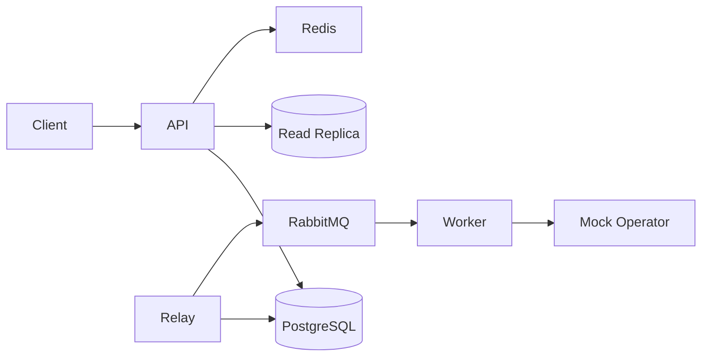

# SMS Gateway — Architecture & Implementation

> Engineering submission for ArvanCloud software developer challenge.

## Overview

This project implements a prepaid SMS Gateway REST API designed for high throughput (~100M messages/day) with burst tolerance. The API accepts send requests asynchronously (`202 Accepted`), deducts balance in a transactional path, and delivers messages through a RabbitMQ-backed pipeline with a transactional outbox pattern.

Key patterns: fire-and-forget acceptance, transactional outbox, idempotent API and consumers, read/write database split, express (OTP) priority queues, and circuit breaker on the operator adapter.

## Architecture

Phase 1 delivers the foundation: three Go binaries (`api`, `worker`, `outbox-relay`), PostgreSQL schema, Redis, and RabbitMQ via docker-compose. Phase 2 adds account identification, prepaid balance, and ledger audit trail. Phase 3 adds fire-and-forget send with transactional outbox and idempotent retries. Phase 4 wires the async pipeline: outbox relay, RabbitMQ, mock operator, and worker status updates. Observability and HAProxy are added in later phases.



## Key Design Decisions

- **Modular monolith** with separate binaries for API, worker, and outbox relay — simpler ops for a 7-day challenge while keeping clear scaling boundaries.
- **Transactional outbox** ensures balance deduction and message enqueue are atomic (implemented in Phase 3).
- **Pre-seeded `X-Account-Token`** instead of a full auth system, per challenge requirements. Tokens are stored as SHA-256 hashes; middleware resolves `account_id` on every `/v1/*` request.
- **CQRS-lite read/write split** via GORM dbresolver: mutations hit primary; balance/ledger reads can use replica (falls back to primary in local dev).

## Account & Balance (Phase 2)

| Endpoint | Method | DB | Description |
|---|---|---|---|
| `/v1/account/topup` | POST | Write (primary) | Demo/admin topup — increases balance + ledger entry in one TX |
| `/v1/account/balance` | GET | Read (replica) | Current prepaid balance |
| `/v1/account/ledger` | GET | Read (replica) | Cursor-paginated topup/deduct history |

**Topup transaction:** `BEGIN` → `SELECT ... FOR UPDATE` on account → update balance → insert `account_ledger` (reason=`topup`) → `COMMIT`.

**Multi-tenant isolation:** every query filters by `account_id` from the resolved token. Invalid or missing token → `401 Unauthorized`.

**Demo tokens** (created by `make seed`):

- `demo-token-account-a`
- `demo-token-account-b`

Topup is exposed for demo/reviewer convenience; in production it would be restricted by network ACL or admin credentials.

## Send SMS + Outbox (Phase 3)

| Endpoint | Method | DB | Description |
|---|---|---|---|
| `/v1/sms/send` | POST | Write (primary) | Accept send, deduct balance, insert message + outbox in one TX → `202` |
| `/v1/sms` | GET | Read (replica) | Cursor-paginated message list |
| `/v1/sms/{id}` | GET | Read (replica) | Single message status |

**Send transaction (same TX, lock order: account → idempotency → deduct):**

```sql
BEGIN;
SELECT balance FROM accounts WHERE id = $1 FOR UPDATE;
-- idempotency: claim key or return cached snapshot
UPDATE accounts SET balance = balance - cost WHERE id = $1;
INSERT INTO account_ledger (delta, reason='send', ref_id=message_id);
INSERT INTO sms_messages (status='accepted', ...);
INSERT INTO outbox_events (event_type='sms.send_requested', status='pending', payload=...);
UPDATE idempotency_keys SET response_snapshot = ...;  -- if Idempotency-Key present
COMMIT;
```

**Validation:** E.164 phone (`+989...`), single-page body (GSM-7 ≤160 chars, UCS-2 ≤70 for Persian/Unicode), `message_type` = `standard` | `express`. Cost = 1 unit per message (same price for EN/FA).

**Idempotency:** optional header `Idempotency-Key: <UUID>`. Unique `(account_id, idempotency_key)`. Middleware fast-path returns stored `202` response; duplicate in-flight requests get `409 Conflict` instead of a second deduct. Worker dedup via `processed_consumer_events` (Phase 4).

**Outbox:** relay publishes pending rows to RabbitMQ with publisher confirms; worker completes delivery (Phase 4). No RabbitMQ publish before TX commit.

Example:

```bash
curl -X POST http://localhost:8080/v1/sms/send \
  -H "X-Account-Token: demo-token-account-a" \
  -H "Content-Type: application/json" \
  -d '{"to":"+989121234567","body":"Hello","message_type":"standard"}'

# Safe retry with idempotency
curl -X POST http://localhost:8080/v1/sms/send \
  -H "X-Account-Token: demo-token-account-a" \
  -H "Idempotency-Key: 550e8400-e29b-41d4-a716-446655440000" \
  -H "Content-Type: application/json" \
  -d '{"to":"+989121234567","body":"Hello","message_type":"standard"}'
```

**Errors:** `402` insufficient balance, `409` idempotency in progress (retry later), `400` validation (phone, body length, message type).

## Async Pipeline (Phase 4)

After Phase 3 commits a send, delivery continues asynchronously:

```text
API TX (deduct + sms_messages + outbox pending)
  → outbox-relay (FOR UPDATE SKIP LOCKED)
  → RabbitMQ queue by message_type (sms.express | sms.standard)
  → worker (dedup + HTTP mock operator)
  → sms_messages.status = sent
```

| Binary | Role |
|---|---|
| `outbox-relay` | Polls `outbox_events`, publishes with publisher confirms, marks `published` |
| `worker` | Consumes both queues, calls mock operator, updates status |
| `mock-operator` | Configurable latency/failure HTTP stand-in for telco operator |

**Relay:** `SELECT ... WHERE status='pending' FOR UPDATE SKIP LOCKED`, set `locked_until`, publish JSON payload, then `UPDATE status='published'`. On publish failure: increment `retry_count`, release lock — no RabbitMQ publish before TX commit (write path unchanged from Phase 3).

**Worker dedup:** `processed_consumer_events(message_id)` claim with `ON CONFLICT DO NOTHING` **before** operator call; transient failures release the claim for retry; permanent operator errors mark `failed` and ack. Duplicate deliveries are acked without double operator calls.

**Graceful shutdown:** relay and worker stop polling/consuming on SIGTERM, wait for in-flight work up to configured timeout.

Example end-to-end:

```bash
docker compose up -d
make migrate-up && make seed

# four terminals (or compose services in production)
make run-api
make run-mock-operator
make run-relay
make run-worker

curl -X POST http://localhost:8080/v1/sms/send \
  -H "X-Account-Token: demo-token-account-a" \
  -H "Content-Type: application/json" \
  -d '{"to":"+989121234567","body":"Hello","message_type":"standard"}'

# Poll until status becomes sent
curl http://localhost:8080/v1/sms/{message_id} \
  -H "X-Account-Token: demo-token-account-a"
```

## Scale Considerations

Target: ~1.2K msg/s average, 12–25K msg/s peak. API returns quickly; workers scale horizontally. Rate limiting and bulkhead pools are added in Phase 5.

## How to Run

```bash
cp .env.example .env
docker compose up -d
make migrate-up
make seed
make run-api
```

Example:

```bash
curl -X POST http://localhost:8080/v1/account/topup \
  -H "X-Account-Token: demo-token-account-a" \
  -H "Content-Type: application/json" \
  -d '{"amount":1000}'

curl http://localhost:8080/v1/account/balance \
  -H "X-Account-Token: demo-token-account-a"
```

Health checks:

- Liveness: `GET http://localhost:8080/health/live`
- Readiness: `GET http://localhost:8080/health/ready` (includes DB ping)

Infrastructure (docker-compose):

| Service   | Port  |
|-----------|-------|
| PostgreSQL | 5433 |
| Redis      | 6379 |
| RabbitMQ   | 5672 (AMQP), 15672 (management UI) |
| Mock Operator | 8090 |

## API Documentation

Swagger UI will be available at `/swagger/index.html` after Phase 6.

## Testing

```bash
make check    # lint + unit tests + race detector
make test
```

## Trade-offs

- **Single-node PostgreSQL/Redis** in Phase 1–2 for fast local dev; replication and HAProxy added later. When `DATABASE_REPLICA_DSN` is empty, reads use primary.
- **Topup endpoint open** for demo — no separate admin auth system per challenge scope.
- **Local docs** (`.local/`) stay out of Git; only this file and `README.md` are submitted as documentation.
