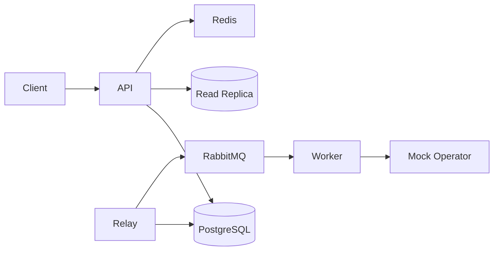

# SMS Gateway — Architecture & Implementation

> Engineering submission for ArvanCloud software developer challenge.

## Overview

This project implements a prepaid SMS Gateway REST API designed for high throughput (~100M messages/day) with burst tolerance. The API accepts send requests asynchronously (`202 Accepted`), deducts balance in a transactional path, and delivers messages through a RabbitMQ-backed pipeline with a transactional outbox pattern.

Key patterns: fire-and-forget acceptance, transactional outbox, idempotent API and consumers, read/write database split, express (OTP) priority queues, and circuit breaker on the operator adapter.

## Architecture

Phase 1 delivers the foundation: three Go binaries (`api`, `worker`, `outbox-relay`), PostgreSQL schema, Redis, and RabbitMQ via docker-compose. Phase 2 adds account identification, prepaid balance, and ledger audit trail. Full async pipeline, observability, and HAProxy are added in later phases.



## Key Design Decisions

- **Modular monolith** with separate binaries for API, worker, and outbox relay — simpler ops for a 7-day challenge while keeping clear scaling boundaries.
- **Transactional outbox** ensures balance deduction and message enqueue are atomic (implemented in Phase 3).
- **Pre-seeded `X-Account-Token`** instead of a full auth system, per challenge requirements. Tokens are stored as SHA-256 hashes; middleware resolves `account_id` on every `/v1/*` request.
- **CQRS-lite read/write split** via GORM dbresolver: mutations hit primary; balance/ledger reads can use replica (falls back to primary in local dev).

## Account & Balance (Phase 2)

| Endpoint | Method | DB | Description |
|---|---|---|---|
| `/v1/account/topup` | POST | Write (primary) | Demo/admin topup — increases balance + ledger entry in one TX |
| `/v1/account/balance` | GET | Read (replica) | Current prepaid balance |
| `/v1/account/ledger` | GET | Read (replica) | Cursor-paginated topup/deduct history |

**Topup transaction:** `BEGIN` → `SELECT ... FOR UPDATE` on account → update balance → insert `account_ledger` (reason=`topup`) → `COMMIT`.

**Multi-tenant isolation:** every query filters by `account_id` from the resolved token. Invalid or missing token → `401 Unauthorized`.

**Demo tokens** (created by `make seed`):

- `demo-token-account-a`
- `demo-token-account-b`

Topup is exposed for demo/reviewer convenience; in production it would be restricted by network ACL or admin credentials.

## Scale Considerations

Target: ~1.2K msg/s average, 12–25K msg/s peak. API returns quickly; workers scale horizontally. Rate limiting and bulkhead pools are added in Phase 5.

## How to Run

```bash
cp .env.example .env
docker compose up -d
make migrate-up
make seed
make run-api
```

Example:

```bash
curl -X POST http://localhost:8080/v1/account/topup \
  -H "X-Account-Token: demo-token-account-a" \
  -H "Content-Type: application/json" \
  -d '{"amount":1000}'

curl http://localhost:8080/v1/account/balance \
  -H "X-Account-Token: demo-token-account-a"
```

Health checks:

- Liveness: `GET http://localhost:8080/health/live`
- Readiness: `GET http://localhost:8080/health/ready` (includes DB ping)

Infrastructure (docker-compose):

| Service   | Port  |
|-----------|-------|
| PostgreSQL | 5433 |
| Redis      | 6379 |
| RabbitMQ   | 5672 (AMQP), 15672 (management UI) |

## API Documentation

Swagger UI will be available at `/swagger/index.html` after Phase 6.

## Testing

```bash
make check    # lint + unit tests + race detector
make test
```

## Trade-offs

- **Single-node PostgreSQL/Redis** in Phase 1–2 for fast local dev; replication and HAProxy added later. When `DATABASE_REPLICA_DSN` is empty, reads use primary.
- **Topup endpoint open** for demo — no separate admin auth system per challenge scope.
- **Local docs** (`.local/`) stay out of Git; only this file and `README.md` are submitted as documentation.
